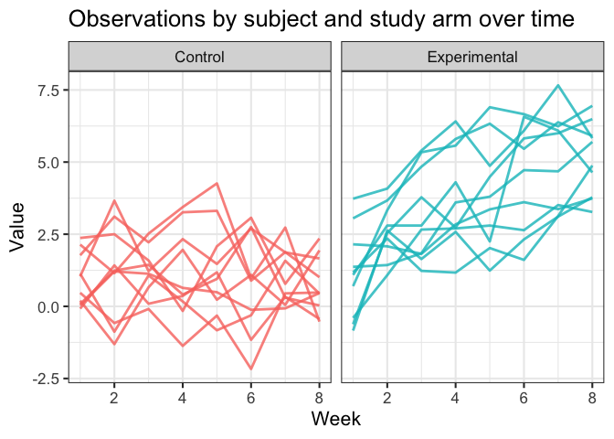

HW5, P1805
================
Aleya Khalifa
2023-11-13

# Problem 1

# Problem 2

## Problem 2.1 Create a tidy dataframe

Create a tidy dataframe containing data from all participants, including
the subject ID, arm, and observations over time.

Create a dataframe containing all file names.

``` r
filenames <- list.files(path = "data/")
```

Iterate over file names and read in data for each subject using
`purrr::map` and saving the result as a new variable in the dataframe.

``` r
df <- purrr::map(filenames, ~read_csv(file.path("data/", .))) %>%
  bind_rows() %>%
  rowid_to_column()
```

Tidy the result; manipulate file names to include control arm and
subject ID, make sure weekly observations are “tidy”, and do any other
tidying that’s necessary. This includes creating a long format dataset
so that values can be plotted over time in the following plot.

``` r
df <- df %>%
  mutate(arm  = ifelse(rowid <11, "Control", "Experimental"),
         id = ifelse(rowid<11, rowid, rowid - 10)) %>%
  select(-rowid) %>%
  relocate(arm, id) %>%
  pivot_longer(
    cols = starts_with("week"),
    names_to = "week",
    values_to = "values",
    names_prefix = "week_"
  ) %>%
  mutate(week = as.numeric(week),
         id = as.character(id))
```

## Problem 2.2 Plot

Make a spaghetti plot showing observations on each subject over time,
and comment on differences between groups.

``` r
ggplot(df, aes(x = week, y = values, group = id)) + 
  geom_line(aes(color = arm), size = 1, alpha = .8) + 
  theme_bw(base_size = 16) + 
  theme(legend.position = "none") +
  facet_grid(~arm) + 
  labs(title = "Observations by subject and study arm over time") +
  xlab("Week") + 
  ylab("Value")
```

<!-- -->

# Problem 3
