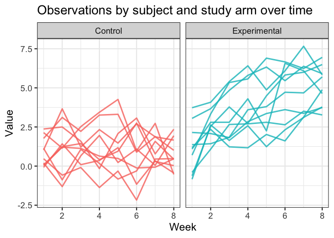
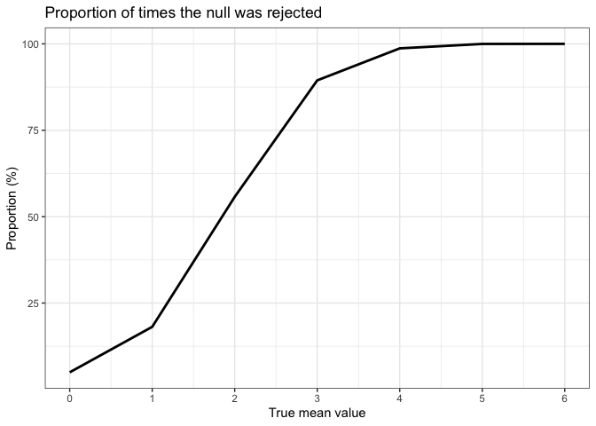

HW5, P1805
================
Aleya Khalifa
2023-11-14

# Problem 2

## Problem 2.1 Create a tidy dataframe

Create a tidy dataframe containing data from all participants, including
the subject ID, arm, and observations over time.

Create a dataframe containing all file names.

``` r
filenames <- list.files(path = "data/")
```

Iterate over file names and read in data for each subject using
`purrr::map` and saving the result as a new variable in the dataframe.

``` r
df <- purrr::map(filenames, ~read_csv(file.path("data/", .))) %>%
  bind_rows() %>%
  rowid_to_column()
```

Tidy the result; manipulate file names to include control arm and
subject ID, make sure weekly observations are “tidy”, and do any other
tidying that’s necessary. This includes creating a long format dataset
so that values can be plotted over time in the following plot.

``` r
df <- df %>%
  mutate(arm  = ifelse(rowid <11, "Control", "Experimental"),
         id = ifelse(rowid<11, rowid, rowid - 10)) %>%
  select(-rowid) %>%
  relocate(arm, id) %>%
  pivot_longer(
    cols = starts_with("week"),
    names_to = "week",
    values_to = "values",
    names_prefix = "week_"
  ) %>%
  mutate(week = as.numeric(week),
         id = as.character(id))
```

## Problem 2.2 Plot

Make a spaghetti plot showing observations on each subject over time,
and comment on differences between groups.

``` r
ggplot(df, aes(x = week, y = values, group = id)) + 
  geom_line(aes(color = arm), size = 1, alpha = .8) + 
  theme_bw(base_size = 16) + 
  theme(legend.position = "none") +
  facet_grid(~arm) + 
  labs(title = "Observations by subject and study arm over time") +
  xlab("Week") + 
  ylab("Value")
```

<!-- -->

# Problem 3

When designing an experiment or analysis, a common question is whether
it is likely that a true effect will be detected – put differently,
whether a false null hypothesis will be rejected. The probability that a
false null hypothesis is rejected is referred to as power, and it
depends on several factors, including: the sample size; the effect size;
and the error variance. In this problem, I will simulate data to explore
power in a one-sample t-test.

Before beginning, set the seed so results are reproducible.

``` r
set.seed(1)
```

## Problem 3.1 Tidy

First set the design elements, `n`, `sd` (σ), and `mean` (μ).

``` r
n = 30
sd = 5
mean = 0
```

Next, generate 5,000 datasets using the model **x ∼ Normal\[μ,σ\]**.
This is stored in `output`.

``` r
output = vector("list", 5000)

for (i in 1:5000) {
  dataset = rnorm(n, mean = mean, sd = sd)
  output[[i]] = dataset
}
```

Then, for each dataset, save μ̂ and the p-value arising from a test of
H:μ=0 using α=0.05. Hint: to obtain the estimate and p-value, use
broom::tidy to clean the output of t.test.

``` r
t_test_fxn = function(a) {

  t.test(a, conf.level = 0.95) %>% 
  broom::tidy() %>% 
  janitor::clean_names() %>%
  select(estimate, p_value)

}

t_test_results_0 = 
  map(output, t_test_fxn) %>%
  bind_rows()
```

Repeat the above for μ={1,2,3,4,5,6} and store. To do this, I will use
simulations.

``` r
sim_function= function(mu) {
  
  data = tibble(
    x = rnorm(n = 30, mean = mu, sd = 5) #specific bounds
  )
  
  output = data %>%
    t.test() %>%
    broom::tidy() %>%
    select(estimate, p.value)
}

sim_results = expand_grid(
  mean_df = c(0,1,2,3,4,5,6),
  iteration = 1:5000) %>%
  mutate(
    estimate = map(mean_df, sim_function)) %>%
  unnest(estimate) 
```

## Problem 3.2 Plot

Make a plot showing the proportion of times the null was rejected (the
power of the test) on the y axis and the true value of μ on the x axis.
Describe the association between effect size and power.

``` r
sim_results %>%
  group_by(mean_df) %>%
  summarize(
    reject_h0 = sum(p.value < 0.05),
    reject_prop = reject_h0/5000*100) %>%
  ggplot(aes(x = mean_df, y = reject_prop)) + 
  geom_line(linewidth = 1) + 
  labs(title = str_wrap("Proportion of times the null hypothesis was rejected dependent on the true mean"),
       x = "True mean value",
       y = "Proportion (%)") + 
  scale_x_continuous(breaks = seq(0, 6, 1)) + 
  theme_bw()
```

<!-- -->

## Problem 3.3 Plot

Make a plot showing the average estimate of μ̂ on the y axis and the true
value of μ on the x axis. Make a second plot (or overlay on the first)
the average estimate of μ̂ only in samples for which the null was
rejected on the y axis and the true value of μ on the x axis. Is the
sample average of μ̂ across tests for which the null is rejected
approximately equal to the true value of μ? Why or why not?
